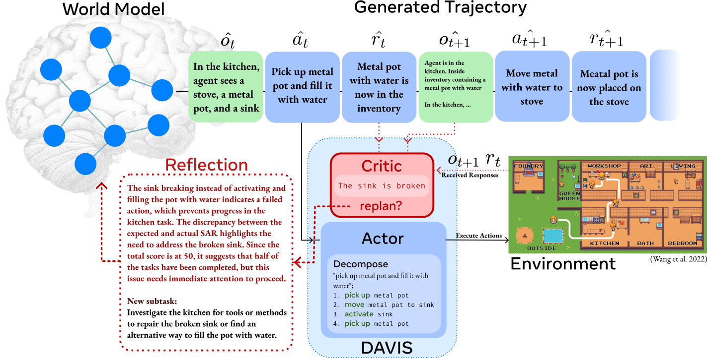

# 🧠 DAVIS: Planning Agent with Knowledge Graph-Powered Inner Monologue

<!--  -->
<div style="text-align: center; background-color: white; padding: 10px;">
   
</div>

> [!NOTE] 
> 🔥 DAVIS will be presented virtually at EMNLP 2025.  
> This repository contains the original code from the DAVIS paper. However, due to updates in dependencies since the time of experiments, the code may currently be unstable.  
> Efforts to clean and update the codebase are ongoing.

## Introduction
Designing a generalist scientific agent capable of performing tasks in laboratory settings to assist researchers has become a key goal in recent Artificial Intelligence (AI) research. Unlike everyday tasks, scientific tasks are inherently more delicate and complex, requiring agents to possess a higher level of reasoning ability, structured and temporal understanding of their environment, and a strong emphasis on safety. Existing approaches often fail to address these multifaceted requirements. To tackle these challenges, we present DAVIS . Unlike traditional retrieval-augmented generation (RAG) approaches, DAVIS incorporates structured and temporal memory, which enables model-based planning. Additionally, DAVIS implements an agentic, multi-turn retrieval system, similar to a human's inner monologue, allowing for a greater degree of reasoning over past experiences. DAVIS demonstrates substantially improved performance on the ScienceWorld benchmark comparing to previous approaches on 8 out of 9 elementary science subjects. In addition, DAVIS's World Model demonstrates competitive performance on the famous HotpotQA and MusiqueQA dataset for multi-hop question answering. To the best of our knowledge, DAVIS is the first RAG agent to employ an interactive retrieval method in a RAG pipeline.

## How to Reproduce
### Steps
1. **Clone the Repository**
   ```
   git clone https:/minhphd/DAVIS
   cd DAVIS
   ```

2. **Install Dependencies (Python 3.11.0)**
   ```
   pip install -r requirements.txt
   ```

3. **Create PostgreSQL Tables**

   Run the following query to create the required tables:

   ```bash
   psql -U your_username -d your_database -f kg_graph/kgraph.psql
   ```

4. **Configure the Project**
   - Fill in `config/config.ini.example` with your API keys, PostgreSQL username, and password.
   - Rename `config/config.ini.example` to `config.ini`

5. **Populate and Construct WorldModel**

   Run the training script:

   ```bash
   python ReasonAgentTraining.py
   ```

   This process might take a while.

6. **Run the Experiments (COSTLY)**

   > [!CAUTION]
   > Ensure you have at least $50 of OpenAI credits available. Short tasks typically take up to 5 minutes, while long tasks can take up to an hour. **Full 90 variations over 30 tasks will take up to $2000 of credits.**

   ```bash
   python ExperimentRunner.py
   ```
